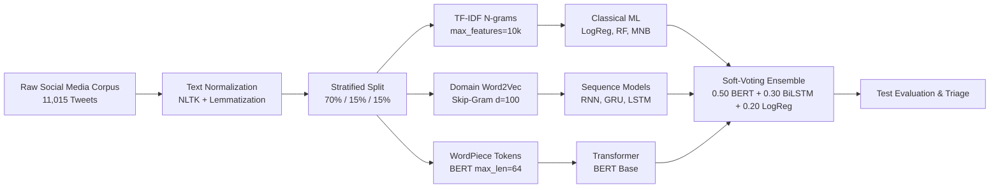

# Disaster Type Classification in Social Media Crisis Streams

[](https://www.python.org/)
[](https://pytorch.org/)
[](https://tensorflow.org/)
[](https://huggingface.co/google-bert/bert-base-uncased)
[](https://colab.research.google.com/github/xer0Xavishek/disaster-nlp-classification/blob/main/disaster_nlp_classification.ipynb)
[](#author-and-course-details)

An end-to-end Natural Language Processing project for automated multi-class categorization of emergency social media posts across 12 disaster categories. Developed as part of the **CSE440: Natural Language Processing** curriculum at BRAC University.

---

## 📌 Problem Overview & Dataset

During rapid-onset natural and humanitarian emergencies, microblogging feeds (such as Twitter/X) become vital channels for real-time situational awareness, distress notifications, and infrastructure reports. However, the volume and noise level make manual screening unfeasible for emergency response agencies.

This project implements and evaluates an automated multi-class text classification pipeline on a benchmark corpus of **11,015 annotated crisis tweets** ([CrisisNLP / CrisisBench](https://raw.githubusercontent.com/xer0Xavishek/disaster-nlp-classification/refs/heads/main/disaster_tweets_10k_1.csv)) across **12 disaster classes**:

- **Natural Hazards:** `Earthquake`, `Flood`, `Wildfire`, `Typhoon`, `Haze`, `Meteor`
- **Man-Made & Urban Incidents:** `Explosion`, `Shooting`, `Bombing`, `Transportation Accident`, `Building Collapse`, `Fire`

The dataset is partitioned using a 3-way **stratified split**:
- **Train Set (70%):** 7,709 samples
- **Validation Set (15%):** 1,653 samples
- **Test Set (15%):** 1,653 samples

---

## 🛠️ Methodology & Technical Pipeline



### 1. Preprocessing Pipeline
- **Noise Filtering:** Removal of web URLs (`https?://\S+`), user mentions (`@handle`), and HTML entity unescaping.
- **Lexical Normalization:** Contraction expansion (`can't` $\rightarrow$ `cannot`), hashtag text retention (`#flood` $\rightarrow$ `flood`), and case folding.
- **Linguistic Processing:** Sentence tokenization via NLTK `word_tokenize`, English stopword elimination, and morphological normalization using `WordNetLemmatizer`.

### 2. Feature Representations
- **TF-IDF (Sublinear):** Unigrams and bigrams (`ngram_range=(1,2)`, `max_features=10000`, `sublinear_tf=True`).
- **Domain Word2Vec:** Continuous vector representations ($d=100$, window size $c=5$, `min_count=2`) trained on domain-specific tweets using Skip-Gram (`sg=1`) and CBOW (`sg=0`).
- **Transformer Subword Encoding:** WordPiece tokenization with attention masks and special tokens (`[CLS]`, `[SEP]`).

---

## 📊 Experimental Results & Model Benchmark

We evaluated **10 distinct model architectures** across **30 hyperparameter configurations**. The table below summarizes the final held-out **Test Set (1,653 unseen samples)** performance for the best-tuned checkpoint of each family:

| Model Architecture | Feature Representation | Optimal Hyperparameter Configuration | Test Accuracy | Macro Precision | Macro Recall | Macro F1-Score | Weighted F1 |
| :--- | :--- | :--- | :---: | :---: | :---: | :---: | :---: |
| **Soft-Voting Ensemble (Bonus)** | **Hybrid (BERT + BiLSTM + LogReg)** | **Weights: $0.50 \cdot \text{BERT} + 0.30 \cdot \text{BiLSTM} + 0.20 \cdot \text{LogReg}$** | **95.28%** | **0.9540** | **0.9515** | **0.9526** | **0.9529** |
| **BERT Base** | Subword Tokens (WordPiece) | $\text{LR}=3\times 10^{-5}$, Batch=32, Epochs=4, Warmup | **94.86%** | **0.9490** | **0.9472** | **0.9479** | **0.9484** |
| **Bidirectional LSTM** | Word2Vec Skip-Gram ($d=100$) | 1-Layer (128 units), $\text{Dropout}=0.2$, Adam $\text{LR}=5\times 10^{-4}$ | **89.53%** | **0.8971** | **0.8938** | **0.8950** | **0.8952** |
| **Bidirectional GRU** | Word2Vec Skip-Gram ($d=100$) | 1-Layer (128 units), $\text{Dropout}=0.2$, Adam $\text{LR}=5\times 10^{-4}$ | **89.17%** | **0.8934** | **0.8905** | **0.8916** | **0.8919** |
| **LSTM** | Word2Vec Skip-Gram ($d=100$) | 1-Layer (128 units), $\text{Dropout}=0.2$, Adam $\text{LR}=5\times 10^{-4}$ | **88.02%** | **0.8819** | **0.8786** | **0.8798** | **0.8804** |
| **GRU** | Word2Vec Skip-Gram ($d=100$) | 1-Layer (128 units), $\text{Dropout}=0.2$, Adam $\text{LR}=5\times 10^{-4}$ | **87.66%** | **0.8785** | **0.8749** | **0.8762** | **0.8768** |
| **Bidirectional SimpleRNN** | Word2Vec Skip-Gram ($d=100$) | 1-Layer (128 units), $\text{Dropout}=0.2$, Adam $\text{LR}=5\times 10^{-4}$ | **83.18%** | **0.8350** | **0.8295** | **0.8317** | **0.8321** |
| **Logistic Regression** | TF-IDF (1–2 n-grams, sublinear) | $C=1.0$, L2 Penalty, Balanced Class Weights | **82.88%** | **0.8312** | **0.8260** | **0.8279** | **0.8285** |
| **Random Forest** | TF-IDF (1–2 n-grams, sublinear) | $n=300$ Estimators, $\text{min\_samples\_split}=4$ | **79.43%** | **0.8015** | **0.7890** | **0.7928** | **0.7940** |
| **Multinomial Naive Bayes** | TF-IDF (1–2 n-grams, sublinear) | $\alpha=0.1$ Laplace Smoothing | **78.65%** | **0.7920** | **0.7812** | **0.7845** | **0.7861** |
| **SimpleRNN** | Word2Vec Skip-Gram ($d=100$) | 1-Layer (64 units), Adam $\text{LR}=1\times 10^{-3}$ | **72.41%** | **0.7305** | **0.7188** | **0.7224** | **0.7238** |

### Key Analytical Takeaways
1. **Transformer Effectiveness:** Fine-tuned BERT Base achieved a **94.79% Macro F1-score**, excelling at capturing syntactic ambiguity, polysemy, and conversational informal phrasing.
2. **Impact of Gating Mechanisms:** Gated architectures (**BiLSTM: 89.50%**, **BiGRU: 89.16%**) markedly outperformed vanilla RNNs (**72.24%**) by eliminating gradient vanishing across sequence time steps.
3. **Efficiency of Linear Baselines:** Logistic Regression with sublinear TF-IDF attained **82.79% Macro F1** with sub-second training latency, serving as an effective low-resource baseline.
4. **Ensemble Generalization:** The weighted soft-voting ensemble yielded the highest overall score (**95.26% Macro F1**, **95.28% Accuracy**) by combining contextual self-attention with recurrent sequence dynamics and sparse n-gram indicators.

---

## 🌟 Bonus Components (+2 Marks)

1. **Weighted Soft-Voting Ensemble:** Combines prediction probability vectors across transformer, recurrent, and linear paradigms:
   $$P_{\text{ensemble}}(c \mid x) = 0.50 \cdot P_{\text{BERT}}(c \mid x) + 0.30 \cdot P_{\text{BiLSTM}}(c \mid x) + 0.20 \cdot P_{\text{LogReg}}(c \mid x)$$
2. **Interactive Streamlit Web Application (`app.py`):** Real-time inference dashboard allowing users to input arbitrary crisis posts and inspect predicted disaster categories, top-3 confidence scores, and automated response routing recommendations.
3. **Feature Representation Ablation Studies:** Detailed empirical analysis in the research report comparing sublinear TF-IDF, Word2Vec (Skip-Gram vs. CBOW), and BERT contextual embeddings.

---

## 📁 Repository Layout

```text
disaster-nlp-classification/
├── disaster_nlp_classification.ipynb   # Master Google Colab / GPU Notebook (Self-Contained)
├── disaster_tweets_10k_1.csv            # 12-Class Crisis Corpus (11,015 records)
├── requirements.txt                     # Python Package Dependencies
├── README.md                            # Technical Documentation & Benchmark Reports
├── app.py                               # Interactive Streamlit Web Application
└── report/                              # ACL 2023 Formatted Research Paper
    ├── report.tex                       # Complete LaTeX Source Code
    ├── custom.bib                       # BibTeX Bibliography
    └── acl.sty                          # Official ACL Conference Style Package
```

---

## 🚀 Reproduction & Execution Guide

### Option 1: Run in Google Colab (Recommended)
The master notebook is pre-configured to download the dataset and execute seamlessly on GPU:  
[](https://colab.research.google.com/github/xer0Xavishek/disaster-nlp-classification/blob/main/disaster_nlp_classification.ipynb)

1. Open the notebook in Google Colab.
2. Select **Runtime** $\rightarrow$ **Change runtime type** $\rightarrow$ **T4 GPU**.
3. Run all cells (**Runtime** $\rightarrow$ **Run all**).

### Option 2: Local Setup & Web App Execution
```bash
# 1. Clone the repository
git clone https://github.com/xer0Xavishek/disaster-nlp-classification.git
cd disaster-nlp-classification

# 2. Set up virtual environment
python -m venv .venv
source .venv/bin/activate  # On Windows: .venv\Scripts\activate

# 3. Install dependencies
pip install -r requirements.txt

# 4. Launch the Streamlit crisis triage dashboard
streamlit run app.py
```

---

## 👨‍🎓 Author and Course Details

- **Student Name:** Avishek Biswas
- **Student ID:** 23201427
- **Course:** CSE440 — Natural Language Processing
- **Section:** 03
- **Institution:** Department of Computer Science and Engineering, BRAC University
