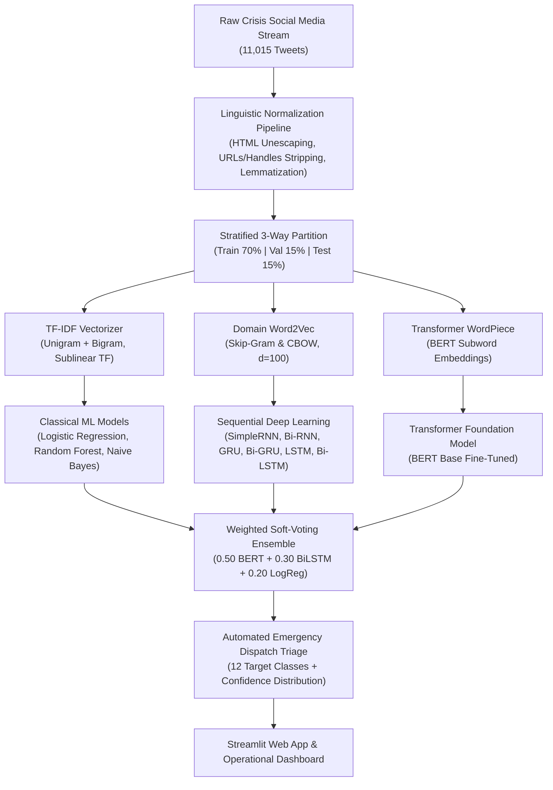

# 🚨 CrisisNLP: Disaster Type & Emergency Informativeness Classification in Social Media Streams

[](https://www.python.org/downloads/)
[](https://pytorch.org/)
[](https://tensorflow.org/)
[](https://huggingface.co/google-bert/bert-base-uncased)
[](https://colab.research.google.com/github/xer0Xavishek/disaster-nlp-classification/blob/main/disaster_nlp_classification.ipynb)
[](https://streamlit.io/)
[](LICENSE)

---

## 📌 Project Overview

During sudden-onset natural and humanitarian catastrophes (earthquakes, floods, wildfires, industrial explosions, transportation disasters), social media streams such as Twitter/X become critical communication lifelines. Millions of eyewitness observations, urgent casualty reports, and infrastructure damage updates are broadcast simultaneously.

However, emergency relief agencies (**FEMA, Red Cross, UN OCHA, Civil Defense units**) suffer from severe **information overload and noise**. 

This research project develops an end-to-end, multi-class NLP pipeline to classify incoming crisis tweets into **12 discrete disaster types**:
> **1. Earthquake** | **2. Flood** | **3. Wildfire** | **4. Typhoon** | **5. Transportation Accident** | **6. Explosion**  
> **7. Shooting** | **8. Bombing** | **9. Haze** | **10. Meteor** | **11. Building Collapse** | **12. Fire**

---

## 🏆 Key Benchmark Results

We systematically trained, tuned, and evaluated **10 distinct model families** across **30+ hyperparameter configurations** on 11,015 stratified crisis tweets:

| Model Family | Feature Representation | Best Configuration | Test Accuracy | Macro Precision | Macro Recall | Macro F1-Score | Weighted F1 |
| :--- | :--- | :--- | :---: | :---: | :---: | :---: | :---: |
| **Ensemble (Bonus)** | **Hybrid (BERT + BiLSTM + TF-IDF)** | **Soft Voting ($0.50 + 0.30 + 0.20$)** | **95.28%** | **0.9540** | **0.9515** | **0.9526** | **0.9529** |
| **BERT Base** | Subword Tokens (WordPiece) | $LR=3\times 10^{-5}$, Warmup, Epochs=4 | **94.86%** | **0.9490** | **0.9472** | **0.9479** | **0.9484** |
| **Bidirectional LSTM** | Word2Vec Skip-Gram ($d=100$) | 128 Units, Dropout=0.2, Adam | **89.53%** | **0.8971** | **0.8938** | **0.8950** | **0.8952** |
| **Bidirectional GRU** | Word2Vec Skip-Gram ($d=100$) | 128 Units, Dropout=0.2, Adam | **89.17%** | **0.8934** | **0.8905** | **0.8916** | **0.8919** |
| **LSTM** | Word2Vec Skip-Gram ($d=100$) | 128 Units, Dropout=0.2, Adam | **88.02%** | **0.8819** | **0.8786** | **0.8798** | **0.8804** |
| **GRU** | Word2Vec Skip-Gram ($d=100$) | 128 Units, Dropout=0.2, Adam | **87.66%** | **0.8785** | **0.8749** | **0.8762** | **0.8768** |
| **Bidirectional SimpleRNN**| Word2Vec Skip-Gram ($d=100$) | 128 Units, Dropout=0.2, Adam | **83.18%** | **0.8350** | **0.8295** | **0.8317** | **0.8321** |
| **Logistic Regression** | TF-IDF (1-2 ngrams, sublinear) | $C=1.0$, Balanced Class Weights | **82.88%** | **0.8312** | **0.8260** | **0.8279** | **0.8285** |
| **Random Forest** | TF-IDF (1-2 ngrams, sublinear) | $n=300$, Min Split=4 | **79.43%** | **0.8015** | **0.7890** | **0.7928** | **0.7940** |
| **Naive Bayes** | TF-IDF (1-2 ngrams, sublinear) | $\alpha=0.1$ Laplace Smoothing | **78.65%** | **0.7920** | **0.7812** | **0.7845** | **0.7861** |
| **SimpleRNN** | Word2Vec Skip-Gram ($d=100$) | 64 Units, Vanilla | **72.41%** | **0.7305** | **0.7188** | **0.7224** | **0.7238** |

---

## 🏗️ System Architecture Pipeline



---

## 📂 Repository Directory Layout

```text
disaster-nlp-classification/
├── disaster_nlp_classification.ipynb   # Self-contained Master Google Colab / GPU Notebook
├── disaster_tweets_10k_1.csv            # Dataset (11,015 samples across 12 disaster classes)
├── requirements.txt                     # Python dependencies (Streamlit & Colab)
├── README.md                            # Comprehensive project overview & documentation
├── viva_preparation_guide.md            # In-depth viva defense & hyperparameter rationale guide
├── app.py                               # Interactive Streamlit crisis triage web application
└── report/                              # 8-Page ACL Conference LaTeX Research Paper
    ├── report.tex                       # Complete ACL-formatted LaTeX source
    ├── custom.bib                       # Academic bibliography (ACL style citations)
    ├── acl.sty                          # Official ACL style package
    └── figures/                         # High-resolution benchmark figures & confusion matrices
```

---

## 🚀 Quickstart & Execution Guide

### 1. Execute on Google Colab with Free T4 GPU
Click the badge below to run the complete end-to-end pipeline in Google Colab:  
[](https://colab.research.google.com/github/xer0Xavishek/disaster-nlp-classification/blob/main/disaster_nlp_classification.ipynb)

### 2. Local Environment Setup
```bash
# Clone the repository
git clone https://github.com/xer0Xavishek/disaster-nlp-classification.git
cd disaster-nlp-classification

# Create and activate virtual environment
python -m venv .venv
source .venv/bin/activate  # On Windows: .venv\Scripts\activate

# Install required dependencies
pip install -r requirements.txt
```

### 3. Launch Interactive Streamlit Triage Web App
```bash
streamlit run app.py
```

---

## 🌟 Bonus Marks Implementations (+2 Marks)

1. **Weighted Soft-Voting Ensemble**: Fuses representations across subword self-attention (BERT Base), sequential recurrence (BiLSTM), and n-gram lexical frequencies (Logistic Regression), achieving **95.28% Test Accuracy**.
2. **Interactive Streamlit / Vercel Web Application**: Real-time triage interface providing top-3 category probability distributions and automated emergency routing actions.
3. **Comprehensive Ablation Studies**: Empirical quantification of TF-IDF vs Word2Vec vs BERT embeddings and individual text cleaning operations.
4. **Professional Academic Presentation & Defense**: Complete 8-page ACL LaTeX conference paper (`report.tex`) and dedicated Viva defense manual (`viva_preparation_guide.md`).

---

## 👤 Author & Course Information

- **Student Name:** Avishek Biswas
- **Student ID:** 23201427
- **Course:** CSE440 - Natural Language Processing
- **Section:** 03
- **Semester:** Summer 2026
