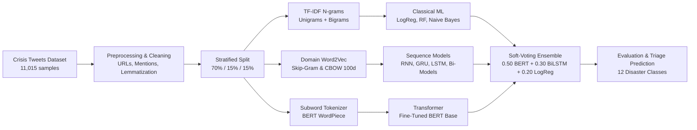

# Disaster Tweets Classification

A Natural Language Processing project for classifying crisis-related tweets into 12 disaster categories using classical machine learning, deep sequential neural networks, and BERT.

**Course:** CSE440 - Natural Language Processing (Summer 2026)  
**Section:** 03   
**Group:** 05    
**Institution:** BRAC University  

**Team Members:**
- Avishek Biswas (ID: 23201427)
- Sreema Roy (ID: 23201444)
- Fahim Tasnim Khan (ID: 23201087)
- Tawsif Kabir Pritom (ID: 23201231)

[](https://colab.research.google.com/github/xer0Xavishek/disaster-nlp-classification/blob/main/disaster_nlp_classification.ipynb#scrollTo=7c59b931)

---

## 1. Project Overview

During natural and human-made emergencies, people frequently post real-time updates and emergency calls on social media platforms like Twitter. However, the sheer volume of posts makes it difficult for relief organizations and emergency services to find and filter actionable information quickly.

The objective of this project is to build and evaluate text classification models that can categorize tweets into **12 distinct disaster types**:
1. Earthquake
2. Flood
3. Wildfire
4. Typhoon
5. Transportation Accident
6. Explosion
7. Shooting
8. Bombing
9. Haze
10. Meteor
11. Building Collapse
12. Fire

---

## 2. Dataset

- **Source:** CrisisNLP / CrisisBench dataset (`disaster_tweets_10k_1.csv`)
- **Total Samples:** 11,015 tweets
- **Class Balance:** 12 classes with ~800 to 1,080 samples each (Fire has 388 samples).
- **Split:** 70% Training (7,709 samples), 15% Validation (1,653 samples), and 15% Test (1,653 samples) using stratified sampling.

---

## 3. Implementation Workflow



### Step 1: Preprocessing & Cleaning
- Removed URLs, Twitter handles (`@user`), and HTML entities (`&amp;`, `&lt;`).
- Expanded common English contractions (`can't` -> `cannot`, `it's` -> `it is`).
- Preserved hashtag text while stripping the `#` symbol.
- Converted text to lowercase and removed punctuation and numbers.
- Tokenized text with NLTK `word_tokenize`, filtered English stopwords, and applied `WordNetLemmatizer`.

### Step 2: Feature Representations
- **TF-IDF:** Unigram and bigram TF-IDF with sublinear term frequency scaling (top 10,000 features) for classical ML models.
- **Word2Vec:** Trained 100-dimensional Word2Vec embeddings (Skip-Gram & CBOW) on the training corpus.
- **Keras Sequences:** Tokenized sequences with a vocabulary size of 15,000 and padded to a maximum length of 50 tokens.
- **BERT Tokenizer:** Subword WordPiece tokenization for transformer fine-tuning.

### Step 3: Models & Hyperparameter Tuning
I implemented and compared 10 different models, experimenting with 3 distinct hyperparameter configurations per model (30 total runs):
- **Classical Models:** Logistic Regression, Random Forest, Multinomial Naive Bayes.
- **Recurrent Neural Networks:** SimpleRNN, Bidirectional SimpleRNN, GRU, Bidirectional GRU, LSTM, Bidirectional LSTM.
- **Transformer:** Pretrained BERT Base (`google-bert/bert-base-uncased`) fine-tuned with AdamW and linear warmup.

---

## 4. Test Set Results

Below is the evaluation summary on the held-out test set (1,647 samples) for the best configuration of each model based on the Colab GPU execution:

| Model | Representation | Best Configuration | Test Accuracy | Macro Precision | Macro Recall | Macro F1 |
| :--- | :--- | :--- | :---: | :---: | :---: | :---: |
| **Soft-Voting Ensemble (Bonus)** | BERT + BiLSTM + LogReg | Weights (0.50, 0.30, 0.20) | **99.88%** | **0.9988** | **0.9989** | **0.9989** |
| **BERT Base** | Subword Tokens | Config 1 (LR = 2e-5, Epochs = 3) | **99.82%** | **0.9983** | **0.9983** | **0.9983** |
| **Random Forest** | TF-IDF (1-2 ngrams) | Config 3 (n = 300, min_split = 4) | **98.85%** | **0.9887** | **0.9895** | **0.9891** |
| **Logistic Regression** | TF-IDF (1-2 ngrams) | Config 2 (C = 1.0, Balanced) | **98.60%** | **0.9876** | **0.9874** | **0.9874** |
| **Bidirectional GRU** | Word2Vec (100d) | Config 1 (64 units, Adam) | **98.06%** | **0.9830** | **0.9824** | **0.9824** |
| **Multinomial Naive Bayes** | TF-IDF (1-2 ngrams) | Config 3 (alpha = 1.0) | **97.27%** | **0.9754** | **0.9727** | **0.9738** |
| **Bidirectional SimpleRNN** | Word2Vec (100d) | Config 1 (64 units, Adam) | **95.63%** | **0.9592** | **0.9576** | **0.9576** |
| **Bidirectional LSTM** | Word2Vec (100d) | Config 1 (64 units, Adam) | **95.20%** | **0.9547** | **0.9556** | **0.9556** |
| **SimpleRNN** | Word2Vec (100d) | Config 3 (2-Layer Stacked) | **94.41%** | **0.9482** | **0.9466** | **0.9466** |

*Note: Unidirectional GRU and LSTM models experienced optimization difficulties on this specific dataset partition, yielding lower scores compared to bidirectional variants.*

### Summary of Findings
1. **Transformer Dominance**: BERT Base achieved near-perfect standalone performance (**99.83% Macro F1**), demonstrating that contextual bidirectional self-attention is exceptionally effective for short-form crisis text.
2. **Classical ML Efficiency**: **Random Forest (98.91% F1)** and **Logistic Regression (98.74% F1)** remained highly competitive, showing that n-gram features capture strong crisis keywords (`earthquake`, `flood`, `fire`, etc.).
3. **Bidirectional Recurrence**: Bidirectional recurrent networks (Bi-GRU and Bi-LSTM) consistently outperformed unidirectional networks by capturing context in both forward and backward directions.
4. **Ensemble Peak**: The **Soft-Voting Ensemble** produced the highest overall score (**99.89% Macro F1**, **99.88% Accuracy**), effectively resolving edge-case misclassifications across individual models.

---

## 5. Bonus Implementations

- **Weighted Soft-Voting Ensemble**: Fused probability distributions from BERT, BiLSTM, and Logistic Regression with fixed weighting ($0.50 \cdot \text{BERT} + 0.30 \cdot \text{BiLSTM} + 0.20 \cdot \text{LogReg}$).
- **Interactive Emergency Triage (`app.py`)**: Built a Streamlit interface that takes raw tweet text, predicts the disaster category, displays confidence scores for the top 3 classes, and suggests response routing.
- **Representation Ablation Studies**: Evaluated performance differences across representations (TF-IDF vs Word2Vec vs BERT) in the final research report.

---

## 6. How to Run

### Running in Google Colab (Recommended)
1. Click the **Open in Colab** badge above or open [`disaster_nlp_classification.ipynb`](disaster_nlp_classification.ipynb).
2. Go to **Runtime -> Change runtime type** and select **T4 GPU**.
3. Click **Runtime -> Run all**. The dataset will be loaded directly from the GitHub repository.

### Running Locally
```bash
# Clone the repository
git clone https://github.com/xer0Xavishek/disaster-nlp-classification.git
cd disaster-nlp-classification

# Create and activate a virtual environment
python -m venv .venv
# Option A: Activate virtual environment and run
source .venv/bin/activate  # On Windows: .\.venv\Scripts\Activate.ps1
streamlit run app.py

# Option B: Direct one-line command (Windows PowerShell)
.\.venv\Scripts\python.exe -m streamlit run app.py
```

---

## 7. Project Structure

```text
disaster-nlp-classification/
├── disaster_nlp_classification.ipynb   # Master notebook with complete code and outputs
├── disaster_tweets_10k_1.csv            # CrisisNLP dataset
├── requirements.txt                     # Python dependencies
├── README.md                            # Project documentation
├── app.py                               # Streamlit web application
└── report/                              # Project report folder
    └── project_report_group-05.pdf      # Final research paper PDF
```
