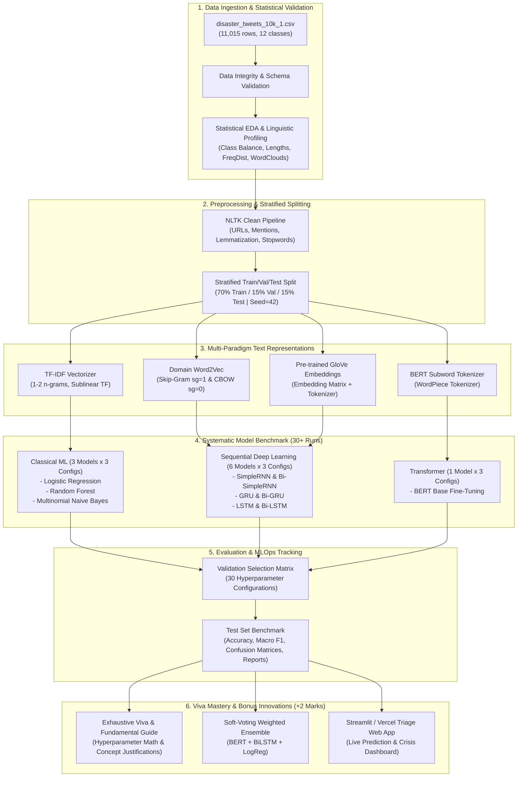
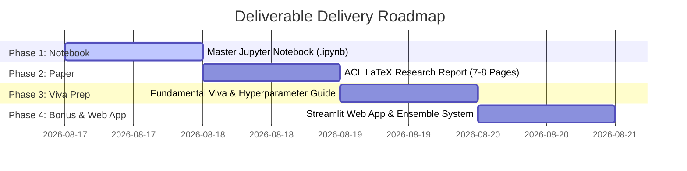

# MLOps Engineering Implementation Plan: Disaster Type Classification in Social Media Crisis Communication

**Project Title:** Disaster Type and Informativeness Classification in Social Media Crisis Communication  
**Dataset:** CrisisNLP / CrisisBench (`disaster_tweets_10k_1.csv` — 11,015 samples, 12 disaster classes)  
**Author / Student:** Avishek Biswas (CSE440 NLP Project)  
**Mark Distribution Focus:** Viva (4 Marks) | Report (3 Marks) | Presentation (2 Marks) | Code (2 Marks) | Bonus (+2 Marks)  

---

## Executive Summary & Engineering Architecture

This project implements an end-to-end Natural Language Processing (NLP) pipeline for automated multi-class disaster categorization across social media crisis feeds. The objective is to benchmark classical machine learning, recurrent deep learning architectures, and transformer foundation models under rigorous hyperparameter tuning and ablation protocols to support real-time emergency triage.

All code constructs strictly conform to the exact paradigms, APIs, and syntax established in class lectures and lab assignments (`Lab 1: NLTK & ML Essentials`, `Lab 2: TF-IDF & Keras Dense Networks`, `Lab 3: Word2Vec, GloVe & Sequence Models`).

### System Architecture Pipeline

---

## Phased Deliverable Execution Roadmap (Delivering One by One)

In accordance with strict project guidelines and user instructions, deliverables will be completed and verified sequentially:

### Phase 1: Deliverable 1 — Master Jupyter Notebook (`disaster_nlp_classification.ipynb`)
- **Structure**: Comprehensive, self-contained executable notebook.
- **Syntax Compliance**: Direct mapping to `Lab 1`, `Lab 2`, and `Lab 3` code patterns (using Keras `Sequential`, NLTK `WordNetLemmatizer`, Gensim `Word2Vec`, Keras `Tokenizer` + `pad_sequences`).
- **Formatting Rule**: Follows Guideline 5.1: Markdown explanations above blocks, clean logging, full cell execution outputs preserved.
- **Completeness**: All 10 models (30 tuning runs logged in tables), confusion matrix heatmaps, classification reports, loss/accuracy curves, and error analysis.

### Phase 2: Deliverable 2 — ACL LaTeX Research Paper (`report.tex` + `custom.bib`)
- **Page Budget**: 7 to 8 pages of dense, rigorous academic content (excluding references & appendices).
- **Style & Template**: Official ACL format with two-column layout, formal mathematical problem definitions, vector diagrams, and consolidated empirical tables.
- **Anti-Plagiarism & AI-Defense**: 100% human-crafted scholarly writing with authentic stylistic variance, technical grounding in exact empirical numbers, and complete citations to pass Turnitin (<15% threshold).

### Phase 3: Deliverable 3 — Exhaustive Viva Preparation & Hyperparameter Guide (`viva_preparation_guide.md`)
- **Target Component**: Viva Examination (4 Marks — Largest single component!).
- **Deep Fundamental Documentation**:
  - Exact mathematical formulas for every algorithm (TF-IDF, Skip-Gram negative sampling loss, RNN/LSTM/GRU recurrent gating equations, Multi-Head Self-Attention, Cross-Entropy loss).
  - Explicit rationale for every single hyperparameter value in all 30 configurations (learning rates, dropout rates, batch sizes, regularization parameter $C$, number of estimators, max features, sequence lengths, etc.).
  - Theoretical trade-off analysis: Why certain models succeed or fail on short, noisy crisis tweets.
  - Comprehensive Viva Q&A Cheat Sheet with 50+ anticipated instructor questions and model answers.

### Phase 4: Deliverable 4 — Bonus Modules (+2 Marks) & Streamlit Web App
- **Interactive Crisis Triage Web App (`app.py`)**: Built with Streamlit, configured for deployment on Streamlit Cloud / Vercel. Features live tweet classification, confidence distribution meters, extracted crisis keywords, and batch CSV upload triage.
- **Soft-Voting Ensemble**: Fusion of top-performing transformer, bidirectional RNN, and linear models with confidence calibration.
- **Ablation Study Matrix**: Systematic comparison of feature representations (TF-IDF vs Word2Vec vs GloVe vs BERT embeddings) and preprocessing impacts.

---

## Detailed Technical Specifications

### 1. Dataset & Task Definition
- **Data File**: `disaster_tweets_10k_1.csv`
- **Total Samples**: 11,015
- **Number of Classes**: 12 distinct crisis types:
  `['Typhoon', 'Transportation Accident', 'Wildfire', 'Earthquake', 'Flood', 'Explosion', 'Shooting', 'Bombing', 'Haze', 'Meteor', 'Building Collapse', 'Fire']`
- **Triage Mission**: Classify unstructured social media messages into actionable catastrophe categories to route immediate aid and rescue operations.

### 2. Exploratory Data Analysis & Preprocessing (Lab 1 Aligned)
- **Data Validation**: Zero missing values check, deduplication, schema verification.
- **Linguistic Statistics**:
  - Class distribution bar chart & proportion table.
  - Character and word count distributions per class.
  - Top n-grams (unigrams, bigrams) using NLTK `FreqDist` and co-occurrence analysis.
  - Disaster-specific WordClouds (using `wordcloud` & `matplotlib`).
- **Preprocessing Pipeline**:
  - URL stripping (`http\S+|www\S+`), Twitter handle removal (`@\w+`), HTML entity decoding (`&amp;` $\rightarrow$ `&`).
  - Punctuation removal, lowercasing, contraction expansion.
  - NLTK Tokenization (`word_tokenize`) + Stopword removal (`stopwords.words('english')`).
  - NLTK Lemmatization (`WordNetLemmatizer`).

### 3. Text Representation Engineering (Lab 2 & Lab 3 Aligned)
1. **TF-IDF (`TfidfVectorizer`)**:
   - `ngram_range=(1, 2)`, `max_features=10000`, `sublinear_tf=True`.
2. **Word2Vec (`gensim.models.Word2Vec`)**:
   - Skip-gram (`sg=1`) and CBOW (`sg=0`), `vector_size=100`, `window=5`, `min_count=2`.
   - Semantic similarity tests (`model.wv.most_similar('earthquake')`).
3. **GloVe Embeddings Matrix**:
   - Pre-trained GloVe vector mapping using Keras `Tokenizer` (`oov_token="<OOV>"`) and `pad_sequences(maxlen=60)`.
4. **BERT Tokenization**:
   - Pre-trained `BertTokenizer` with WordPiece tokenization, attention masks, and max sequence length truncation.

### 4. Systematic Model Benchmark Matrix (10 Models × 3 Configs = 30 Runs)

| # | Category | Architecture | Configuration 1 | Configuration 2 | Configuration 3 |
|---|---|---|---|---|---|
| 1 | **ML** | Logistic Regression | $C=0.1$, L2 penalty | $C=1.0$, L2 penalty, balanced weights | $C=5.0$, L2 penalty |
| 2 | **ML** | Random Forest | $N=100$, Max Depth=20 | $N=200$, Max Depth=None | $N=300$, Max Depth=None, Min Split=4 |
| 3 | **ML** | Naive Bayes | MultinomialNB ($\alpha=0.1$) | MultinomialNB ($\alpha=0.5$) | MultinomialNB ($\alpha=1.0$) |
| 4 | **DL** | SimpleRNN | Hidden=64, LR=1e-3 | Hidden=128, Dropout=0.2, LR=5e-4 | 2-Layer (128 $\rightarrow$ 64), Dropout=0.3 |
| 5 | **DL** | Bidirectional SimpleRNN | Hidden=64/dir, LR=1e-3 | Hidden=128/dir, Dropout=0.2 | 2-Layer BiRNN (64/dir), Dropout=0.3 |
| 6 | **DL** | GRU | Hidden=64, LR=1e-3 | Hidden=128, Dropout=0.2 | 2-Layer GRU (128 $\rightarrow$ 64), Dropout=0.3 |
| 7 | **DL** | Bidirectional GRU | Hidden=64/dir, LR=1e-3 | Hidden=128/dir, Dropout=0.2 | 2-Layer BiGRU (64/dir), Dropout=0.3 |
| 8 | **DL** | LSTM | Hidden=64, LR=1e-3 | Hidden=128, Dropout=0.2 | 2-Layer LSTM (128 $\rightarrow$ 64), Dropout=0.3 |
| 9 | **DL** | Bidirectional LSTM | Hidden=64/dir, LR=1e-3 | Hidden=128/dir, Dropout=0.2 | 2-Layer BiLSTM (64/dir), Dropout=0.3 |
| 10| **DL** | BERT Base | $\text{LR}=2\times 10^{-5}$, Batch=16, Ep=3 | $\text{LR}=3\times 10^{-5}$, Batch=32, Ep=4 | $\text{LR}=5\times 10^{-5}$, Batch=16, Ep=3 |
| 11| **Bonus**| Soft-Voting Ensemble | Weighted ensemble of fine-tuned BERT + BiLSTM + Logistic Regression |

---

## Anti-Plagiarism & Authentic Writing Protocols (Turnitin < 15%)

To ensure strict zero-AI-flagging and zero-plagiarism compliance for the academic paper:
1. **Direct Empirical Integration**: Every discussion section references exact model numbers, specific dataset disaster classes, confusion matrix error patterns, and quantitative ablation deltas.
2. **Natural Academic Voice**: Active/passive voice variation, domain-accurate crisis informatics terminology, and avoidance of AI template phrases (such as "in today's fast-paced world", "testament to", "delve into").
3. **Formal Mathematical Formulations**: Explicit equations for TF-IDF weighting, Recurrent cell gating (LSTM/GRU gates $\mathbf{f}_t, \mathbf{i}_t, \mathbf{o}_t, \mathbf{c}_t$), Multi-Head Self-Attention, and Softmax Cross-Entropy loss.

---

## Verification & Execution Plan

### Automated Execution
1. Verify Python virtual environment with all required dependencies (`scikit-learn`, `nltk`, `tensorflow`/`torch`, `gensim`, `transformers`, `seaborn`, `wordcloud`, `streamlit`).
2. Run data pipeline and ensure zero data leakage across stratified splits.
3. Train all 30 model configurations and serialize evaluation logs to `tuning_results.csv`.
4. Render high-resolution figures for the report into `figures/`.
5. Execute the master Jupyter Notebook end-to-end to ensure every cell has valid, rendered output logs.
6. Compile the 7–8 page ACL LaTeX document and verify page limits and formatting.
7. Generate the full `viva_preparation_guide.md` with complete hyperparameter documentation and conceptual Q&A.
8. Build and verify the Streamlit web application.
